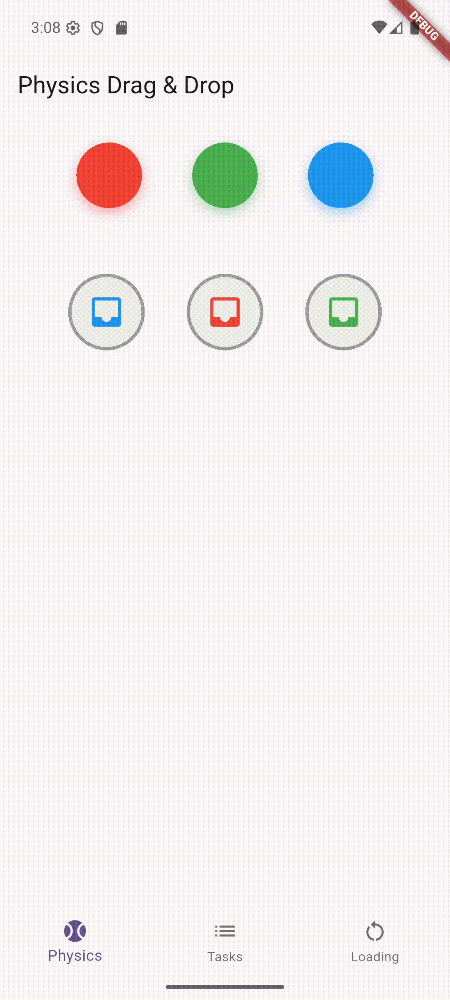
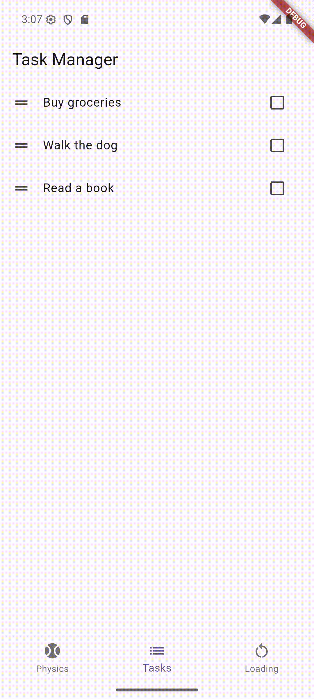
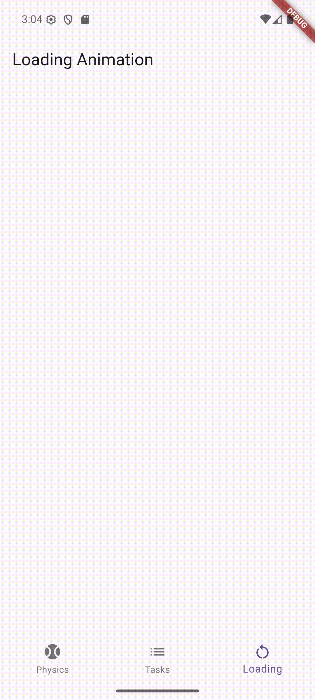

# Flutter Widget Exploration

A Flutter application demonstrating interactive and animated UI patterns:

- Drag & drop color match game  
- Swipe-to-manage task list  
- Loading dots animation  

---

## 📖 Overview

Each section explains the goal, the key widgets/APIs, and the core logic, with a GIF preview and a link to the source file.

---

## 1) Drag & Drop Color Match ("Balls" Game)

Match colored balls to their corresponding containers using drag and drop.

  

**Source**: [`lib/interactive_physics_widget.dart`](lib/interactive_physics_widget.dart)  
**Key widgets & APIs**: `Draggable`, `DragTarget`, `AnimatedContainer`, `Random`, `setState`  

### How it works
- Colors are defined once. `randomizeGame()` shuffles balls and containers using `Random()` and resets a `matched` map.  
- Each ball is a `Draggable<Color>`; while dragging, a semi-transparent `feedback` is shown and the original dims via `childWhenDragging`.  
- Each container is a `DragTarget<Color>` that reacts to hover with an `AnimatedContainer`. `onWillAccept` blocks already-matched slots.  
- In `onAccept`, compare dropped `Color` with the target’s expected color; mark `matched[color] = true` on success, otherwise show a hint.  
- When all values in `matched` are true, show a completion banner and a restart button to reshuffle.  

---

## 2) Interactive Task List (Dismiss + Reorder)

Manage tasks with swipe-to-delete, undo, checkboxes, and drag-to-reorder.

  

**Source**: [`lib/interactive_dismissable_list.dart`](lib/interactive_dismissable_list.dart)  
**Key widgets & APIs**: `Dismissible`, `SnackBar`, `AlertDialog`,  
`ReorderableListView.builder`, `ReorderableDragStartListener`, `Checkbox`  

### How it works
- Tasks and completion states are stored in parallel lists: `_tasks` and `_checked`.  
- Each row is wrapped in `Dismissible` with `DismissDirection.endToStart`; `confirmDismiss` opens an `AlertDialog`.  
- On delete, store the removed task/index to enable Undo via `SnackBarAction`; undo reinserts the task and its checked state.  
- Reordering is handled by `ReorderableListView.builder`; `onReorder` keeps `_tasks` and `_checked` in sync. Use `ReorderableDragStartListener` as a handle.  
- Toggling `Checkbox` updates `_checked[index]`; completed tasks render with a line-through style.  

---

## 3) Loading Dots Animation (Staggered)

Three dots animate in a loop with staggered scale and fade.

  

**Source**: [`lib/loading_animation.dart`](lib/loading_animation.dart)  
**Key widgets & APIs**: `AnimationController`, `AnimatedBuilder`, `CurvedAnimation`, `Interval`,  
`Transform.scale`, `Opacity`, `SingleTickerProviderStateMixin`  

### How it works
- A single `AnimationController` repeats every 1200ms. For each dot, scale and opacity are driven by a `CurvedAnimation` with `Interval(index * 0.2, ...)` for stagger.  
- Inside `AnimatedBuilder`, a `Row` generates three circular dots that read the current values and rebuild smoothly.  
- The controller is disposed in `dispose()` to avoid leaks.  

---

## Navigation

Use the bottom navigation bar to switch between the three screens.  

**Source**: [`lib/main.dart`](lib/main.dart)  
**Tabs**: Physics (color match), Tasks (dismiss + reorder), Loading (dots animation)  

---

## Resources

- [Flutter Widget Catalog](https://docs.flutter.dev/ui/widgets/catalog)  
- [Draggable / DragTarget](https://api.flutter.dev/flutter/widgets/Draggable-class.html)  
- [Dismissible](https://api.flutter.dev/flutter/widgets/Dismissible-class.html)  
- [ReorderableListView](https://api.flutter.dev/flutter/material/ReorderableListView-class.html)  
- [AnimatedBuilder](https://api.flutter.dev/flutter/widgets/AnimatedBuilder-class.html)  
